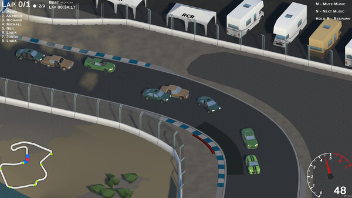
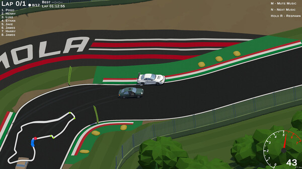

# 🚗 ISO Racer

**ISO Racer** is a fast-paced **isometric racing game** available on **Steam**.  
It combines classic drift mechanics with modern physics and competitive online modes.

---

## 🎮 Overview

Feel the thrill of precision driving and perfect drifts!  
In **ISO Racer**, every corner counts — test your reflexes, master your technique, and climb the global leaderboards.  
Try out the brand-new **BUSTED Mode**, where you switch sides and become the cop chasing other players.

---

## 🔗 Links

- 🕹️ **Steam Page:** [https://store.steampowered.com/app/2234020/Iso_Racer/](https://store.steampowered.com/app/2234020/Iso_Racer/)
- 💬 **News & Updates:** [Steam News](https://store.steampowered.com/news/app/2234020/)

---

## 🧩 Key Features

- Realistic physics and smooth drift handling  
- **Singleplayer**, **Multiplayer**, and **BUSTED Mode**  
- Vehicle and track customization  
- Stylish low-poly isometric visuals  
- Steam achievements and leaderboards  

---

## 🖼️ Screenshots

  
  

---

## ⚙️ System Requirements

**Minimum:**
- OS: Windows 10 (64-bit)  
- CPU: Intel Core i3 or AMD equivalent  
- RAM: 8 GB  
- GPU: Intel HD / GTX 750  
- Storage: 10 GB free space  

**Recommended:**
- OS: Windows 11  
- CPU: Intel i5 / Ryzen 5  
- RAM: 16 GB  
- GPU: GTX 2060 or better  

---

## 👤 Developer

**MMK Games Studio**  
📧 Contact: [maksgamedev@gmail.com]  
🌐 Portfolio / Website: [https://portfolio-page](https://portfolio-page-makschojniaks-projects.vercel.app/) 

---

## 🏁 Join the Race

👉 [Download on Steam](https://store.steampowered.com/app/2234020/Iso_Racer/)

